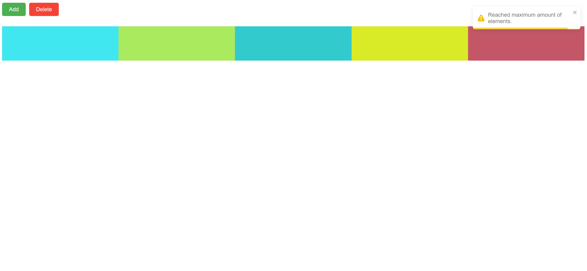

# Animated list project

This project is a simple React application built with TypeScript, Redux Toolkit for state management, `framer-motion` for animations, and `react-toastify` for notifications. The main functionality includes adding and removing colored square elements with smooth animations.

## Table of Contents

- [Features](#features)
- [Technologies Used](#technologies-used)
- [Installation](#installation)
- [Usage](#usage)
- [Demo](#demo)

## Features

- **Add Element**: Add a square element to the list, with a smooth slide-in animation from the left.
- **Remove Element**: Remove the last element from the list, with a smooth slide-out animation to the right.
- **Dynamic Colors**: Each element is assigned a random color upon creation.
- **Notifications**: Toast notifications are shown for various actions like reaching the maximum number of elements or trying to remove an element from an empty list.

## Technologies Used

- **React**: A JavaScript library for building user interfaces.
- **TypeScript**: A typed superset of JavaScript that compiles to plain JavaScript.
- **Redux Toolkit**: The official, recommended way to write Redux logic and manage state.
- **Framer Motion**: A production-ready motion library for React that allows for animations and transitions.
- **React Toastify**: A React notification library.

## Installation

To set up and run the project on your local machine, follow these steps:

### Prerequisites

Ensure you have the following installed:

- [Node.js](https://nodejs.org/) (v14 or later)
- [npm](https://www.npmjs.com/) (v6 or later)

### Steps

1. `npm install`
2. `npm start`

## Usage

Once the development server is running at `http://localhost:3000`, you can interact with the application as follows:

1. **Add an Element**:
   - Click the "Add" button.
   - This action will add a new square element to the list.
   - The new element will smoothly slide in from the left.
   - Existing elements will animate to shift to the right to make space for the new element.

2. **Remove an Element**:
   - Click the "Delete" button.
   - This action will remove the last square element from the list.
   - The last element will smoothly slide out to the right.
   - Existing elements will stay in place without shifting.

3. **Notifications**:
   - **Maximum Elements Reached**: If you attempt to add more elements than the maximum allowed (5), a warning toast notification will appear, informing you that the maximum number of elements has been reached.
   - **Empty List**: If you attempt to remove an element from an empty list, a warning toast notification will appear, informing you that the list is already empty.

4. **Interactive Behavior**:
   - As you interact with the buttons, observe smooth animations powered by Framer Motion.
   - Toast notifications from React Toastify will alert you to any issues or confirmations.

5. **Visuals**:
   - Each element in the list will have a unique, randomly assigned color.
   - The width of each element is 20% of the viewport width, and they are arranged horizontally.

## Demo
